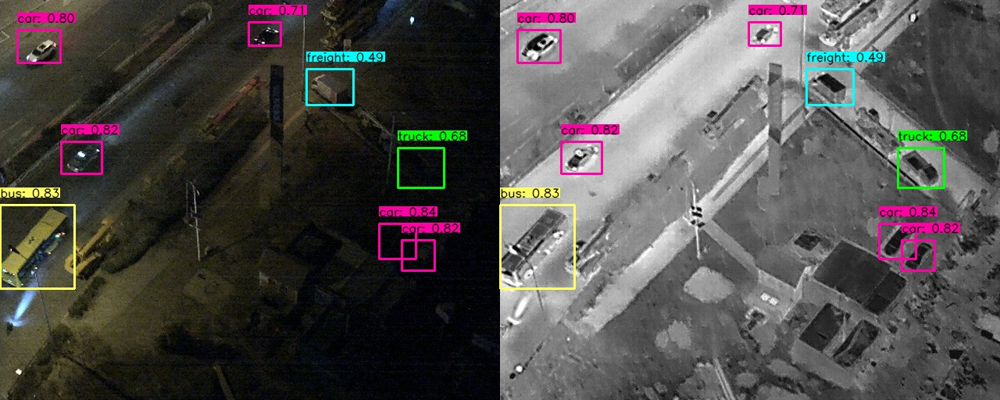

# YOLOV8多模态目标检测（Onnx推理 CPU/GPU）
## 1. 环境安装
## 1.1 GPU Nvidia 4606Ti 
<details open><summary>GPU Nvidia 4606Ti</summary>

### 1.1.1 操作系统
wsl linux ubuntu 22.04
### 1.1.2 软件环境
cuda 11.6/cudnn-linux-x86_64-8.6.0.163/onnxruntime-gpu 1.14/python 3.8.20/opencv-python   4.10.0.84/numpy 1.24.4
####  1.1.2.1 cuda 安装
下载[cuda 11.6](https://developer.nvidia.com/cuda-toolkit-archive)
```shell
# 下载runfile
wget https://developer.download.nvidia.com/compute/cuda/11.6.0/local_installers/cuda_11.6.0_510.39.01_linux.run
# 安装
sudo sh cuda_11.6.0_510.39.01_linux.run

# 配置环境变量
vim ~/.bashrc

# 添加以下变量到文件末尾
export PATH=/usr/local/cuda-11.6/bin:$PATH
export LD_LIBRARY_PATH=/usr/local/cuda-11.6/lib64:$LD_LIBRARY_PATH

# 保存退出
esc -> :wq

# 启用修改
source ~/.bashrc

# 验证环境
nvcc -V


Copyright (c) 2005-2021 NVIDIA Corporation
Built on Fri_Dec_17_18:16:03_PST_2021
Cuda compilation tools, release 11.6, V11.6.55
Build cuda_11.6.r11.6/compiler.30794723_0
```
####  1.1.2.2 cudnn 安装
安装[cudnn](https://developer.nvidia.com/rdp/cudnn-archive)

下载 Download cuDNN v8.6.0 (October 3rd, 2022), for CUDA 11.x -> Local Installer for Linux x86_64 (Tar)

```shell
# 解压
tar -xf  cudnn-linux-x86_64-8.6.0.163_cuda11-archive.tar.xz

# 进入文件目录
cd cudnn-linux-x86_64-8.6.0.163_cuda11-archive

# 将 cuDNN 解压包中 include 文件全部复制到 /usr/local/cuda-11.6/include中
sudo cp ./include/* /usr/local/cuda-11.6/include/

# 将 cuDNN 解压包中 lib 文件全部复制到 /usr/local/cuda-11.6/lib64 中
sudo cp ./lib/* /usr/local/cuda-11.6/lib64/
```
####  1.1.2.3 onnxruntime-gpu/onnxruntime 安装
#####  如果要使用cpu，请安装onnxruntime
```shell
pip install onnxruntime  
```
#####  如果要使用gpu，请安装onnxruntime-gpu
```shell
pip install onnxruntime-gpu==1.14
```
#### 1.1.2.4 opencv 安装
```shell
pip install opencv-python==4.10.0.84
```
#### 1.1.2.5 numpy 安装
```shell
pip install numpy==1.24.4
```

**如果pip下载速度慢可以换[中科大或者清华源](https://blog.csdn.net/qq_45950599/article/details/143948112?spm=1001.2014.3001.5502)**

#### 如果遇到以下错误
>Could not load library libcudnn_cnn_infer.so.8. Error: libcuda.so: cannot open shared object file: No such file or directory

请使用以下指令
```shell
vim ~/.bashrc

#添加到末尾
export LD_LIBRARY_PATH=/usr/lib/wsl/lib:$LD_LIBRARY_PATH

source ~/.bashrc

#或者临时修改
export LD_LIBRARY_PATH=/usr/lib/wsl/lib:$LD_LIBRARY_PATH
```
### 1.1.3 测试安装环境
#### 1.1.3.1 检查是否使用了CUDA和获取当前执行程序的是否使用GPU设备
```shell
python testOnnxRunTime.py

正常结果：
Available providers: ['CUDAExecutionProvider', 'CPUExecutionProvider']
Current device: GPU
```
#### 1.1.3.2 测试时间onnx cpu/gpu时间对比
```shell
python testTime.py

结果：
CPU 推理总时间: 50.8204 秒, 每次推理平均时间: 0.0508 秒
GPU 推理总时间: 8.9798 秒, 每次推理平均时间: 0.0090 秒
GPU 加速比: 5.66 倍
```

**其中cuda、cudnn、和onnxruntime-gpu版本必须兼容，详细参考[ONNX-Cuda官网](https://onnxruntime.ai/docs/execution-providers/CUDA-ExecutionProvider.html)**

</details>

## 1.2 Jetson Orin Nano

## 2 数据集DroneVehicle数据集(可见光+热红外)
<details open><summary>数据集DroneVehicle数据集</summary>
[DroneVehicle数据集下载地址](https://github.com/VisDrone/DroneVehicle) 

DroneVehicle 数据集由无人机采集的 56,878 张图像组成，其中一半是 RGB 图像，其余是红外图像。我们为这 5 个类别制作了丰富的注释，其中包含定向边界框。其中，汽车在 RGB 图像中有 389,779 个注释，在红外图像中有 428,086 个注释，卡车在 RGB 图像中有 22,123 个注释，在红外图像中有 25,960 个注释，公共汽车在 RGB 图像中有 15,333 个注释，在红外图像中有 16,590 个注释，厢式车在 RGB 图像中有 11,935 个注释，在红外图像中有 12,708 个注释，货车在 RGB 图像中有 13,400 个注释， 以及红外图像中的 17,173 个注释。\
在 DroneVehicle 中，为了在图像边界处对对象进行注释，我们在每张图像的顶部、底部、左侧和右侧设置了一个宽度为 100 像素的白色边框，因此下载的图像比例为 840 x 712。在训练我们的检测网络时，我们可以执行预处理以去除周围的白色边框并将图像比例更改为 640 x 512。

</details>

## 3 权重文件下载
<details open><summary>onnx检测权重</summary>

| 模型(FP16)                                                                                           | 尺寸<br><sup>(像素) | mAP<sup>test<br>50 |mAP<sup>test<br>50-95 | 速度<br><sup>CPU (11th Gen Intel Core(TM) i7-11700 2.50GHZ) ONNX<br>(ms) | 速度<br><sup>Nvidia 4070 GPU ONNX<br>(ms) | 模型大小<br><sup>(MB)  |
| -------------------------------------------------------------------------------------------- | --------------- | ------------------ | --------------------------- | -------------------------------- | -------------- | ----------------- |
| [TwoStreamYOLOv8.onnx]() |   640 | 81.5          | 61.5                      |  56.4              | 11.2            | 15            |
</details>


## 4 onnx推理
<details open><summary>onnx</summary>
输入以下指令进行推理

```shell
python onnxDetect.py --onnx=best.onnx --rgbfile=rgb_06144.jpg  --irfile=ir_06144.jpg
```
其中参数含义为：
* onnx: onnx模型文件  
* rgbfile：可见光图片 
* irfile: 红外光图片 

推理结果为

</details>